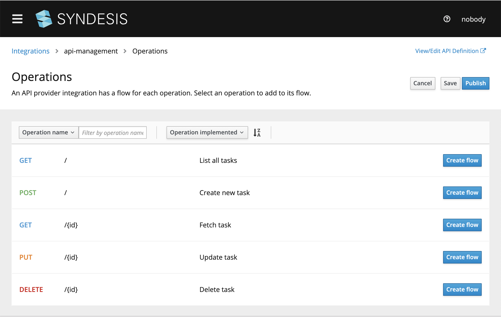
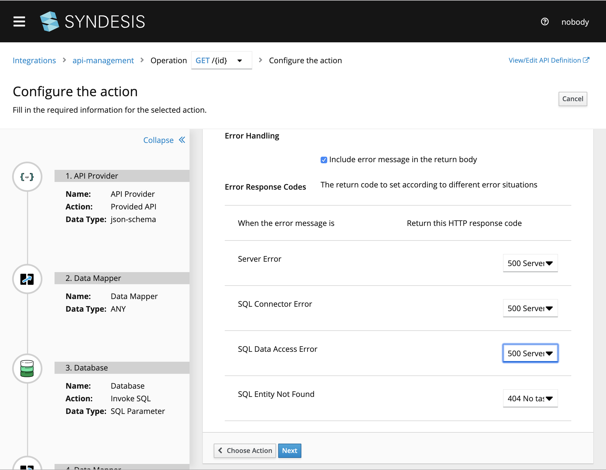

# API Provider

## Introduction
In this scenario we start with a OpenAPI/Swagger file [task-api.json](task-api.json?raw=true) containing an API definition to the TODO Task Management example (copy the url if you want to start from scratch). We will demonstrate how to create a REST API that can invoke your integration flows. Note that at the moment the example integrations use the SQL connector only. We will add other connectors to these flows soon. Adding a REST interface to your integrations allows you to integrate your integrations, so that they can be invoked on demand.


## Screencast of this Quickstart

Link to a screencast of this quickstart on our youtube channel:

[](https://youtu.be/sox8SSqJ0zQ)

*`<<Click to Play>>`*


## Getting Started

You can start by using the API Provider connector and selecting the task-api.json to implement your own flows, or you can start using the export. Here we describe using the export so you can get a feel for how things work quickly. In the Syndesis UI navigate to `Integrations` and click on the `Import` button in the right top corner. Now you can select the [TaskAPI-export.zip](TaskAPI-export.zip?raw=true) file and start the import. On a succesful deployment, go to edit this integration. You will see that this integration contains five flows:

| Flow               | Path             | SQL |
|--------------------|------------------|-----|
| Get all Tasks      | GET /api         | SELECT * FROM TODO |
| Create Task        | POST /api        | INSERT INTO TODO  VALUES (:#id, :#task, :#completed) |
| Get Task by ID     | GET /api/{id}    | SELECT * FROM TODO WHERE ID=:#id |
| Update Task by ID  | PUT /api/{id}    | UPDATE TODO SET completed=:#completed where ID=:#id |
| Delete Task for ID | DELETE /api/{id} | DELETE FROM TODO WHERE ID=:#id |
  

*Figure 1. Paths in the Task API*

We've implemented each flow using just one connection: the SampleDB Connection. We could have used any other connection this is nice and simple, so it does the job demonstrating what the API Provider is all about.


*Figure 2. Flow Implementation*

Besides the SampleDB we use the DataMapper and don't forget to click on the final `Provided API Return Path` step to map Error to HTTP Return codes (which are defined in the Swagger API).


*Figure 3. Return Error Mapping*

Navigate back to the Integration Detail screen and click to `Start` (or `Deploy`) this integration. The deploy process will take a few minutes, but at the tail end of it it will show the URL at which it is live, the `external URL` which should be something like 

https://i-task-management-integration-myproject.192.168.42.72.nip.io/api

That's it, your integration is now live! Let's create an environmental parameter with the external URL using

export externalURL="https://i-task-management-integration-myproject.192.168.42.72.nip.io/api"

Make sure to use the externalURL for your integration. Now we are ready to play with the Task API:

### 1. Create Task "/" 

```
curl -k --header "Content-Type: application/json" --request POST \
        --data '{"id":1, "task":"my first task :)!"}' $externalURL
        
curl -k --header "Content-Type: application/json" --request POST \
        --data '{"id":2, "task":"my second task :|"}' $externalURL
        
curl -k --header "Content-Type: application/json" --request POST \
        --data '{"id":3, "task":"my third task :("}' $externalURL

```

### 2. Get Task "/" 

```
curl -k $externalURL

{"id":1,"task":"my new task!","completed":false}
```

### 3. Get Task by ID "/{id}"

```
curl -k $externalURL/1 

{"id":1,"task":"my new task!","completed":false}
```
 
### 4. Update Task by ID "/{id}" 

```
curl -k $externalURL/1 

{"completed":true}
```

### 5. Delete Task for ID "/{id>}" 

```
curl -k -X DELETE $externalURL/1
```

## Extra Credit

You can check what's going on using the Todo app using (with updated IP address), to find the route use `oc get routes | grep todo` and pick the one that looks like like

https://todo-syndesis.192.168.42.72.nip.io/

and you can login to the DB pod using

```
oc get pods
oc rsh syndesis-db-1-c84cz 
sh-4.2$ psql -Usampledb
sampledb=> select * from todo;
```
