# DynamoDB Provider

## Introduction
In this scenario we will connect to an already existing DynamoDB (DDB) table. We will demonstrate how to read and write elements from the table.

## Requirements

To properly run this quickstart you need an account on Amazon AWS and, at least, one free instance of a DynamoDB table using the "Create table" button.

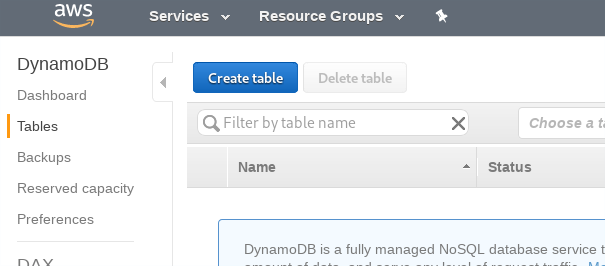

The basic parameters for this noSQL database is the table name and the primary key. The rest of columns will be defined dynamically when elements are inserted.

After creation, we have our table ready to connect.

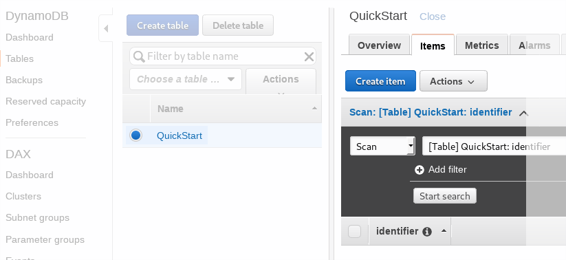

## Steps

First we will create the connector with credentials. Then we will create an integration that first reads from the table and then queries the table. All step outputs will be shown on logs.

### Create DynamoDB Connector

We go to the "Connections" menu and then push "Create Connection" button.

We select the AWS-DDB type of connector from the list. 

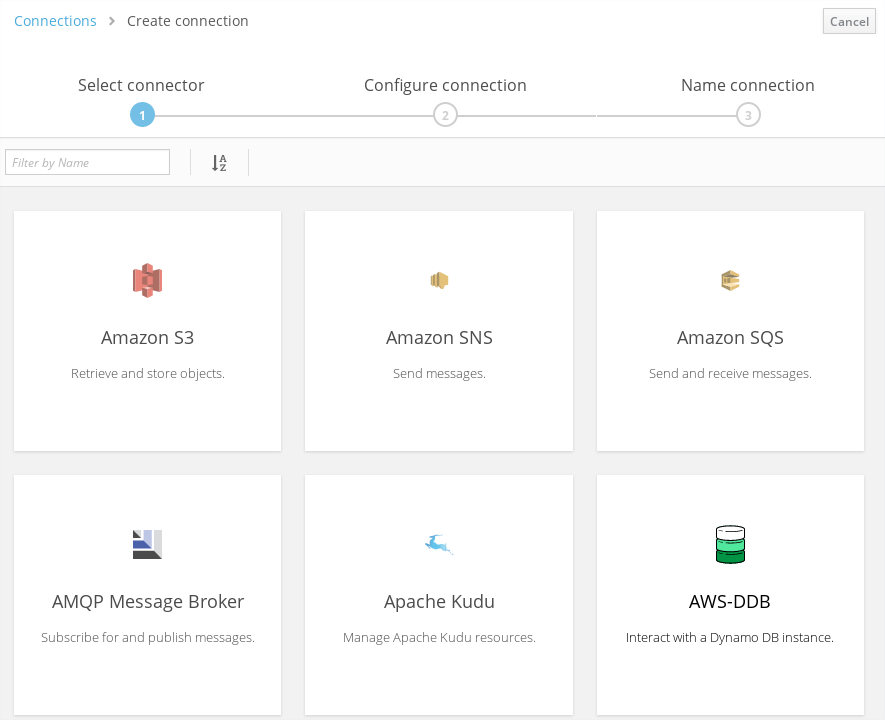

Here we have to fill the credentials and details of the table previously created. 

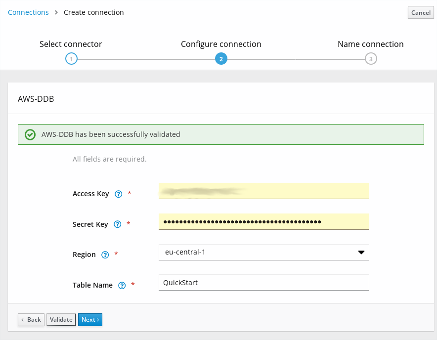

Now we have to assign a proper name that will serve as identifier when creating the connection.

And our connection is ready to be used.

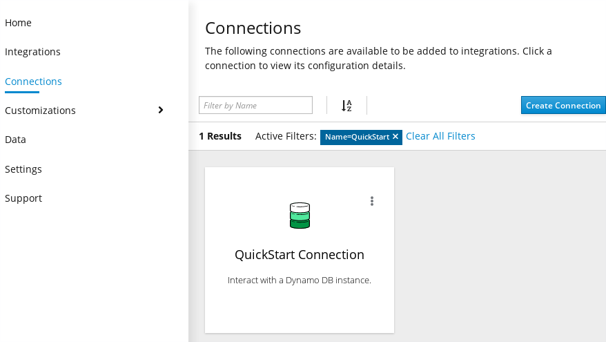

### Create Integration

On our integration we will use a timer, a log, the previously created AWS-DDB connection and a data mapper to link the insert and query operation parameters.

We start by creating a new integration with the "Create Integration" button.

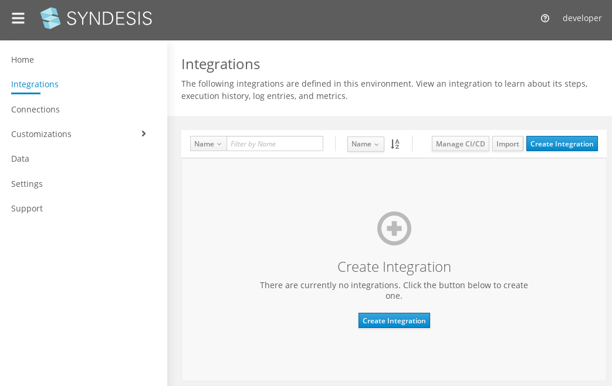

The first step is the timer. This means that the integration will run periodically.

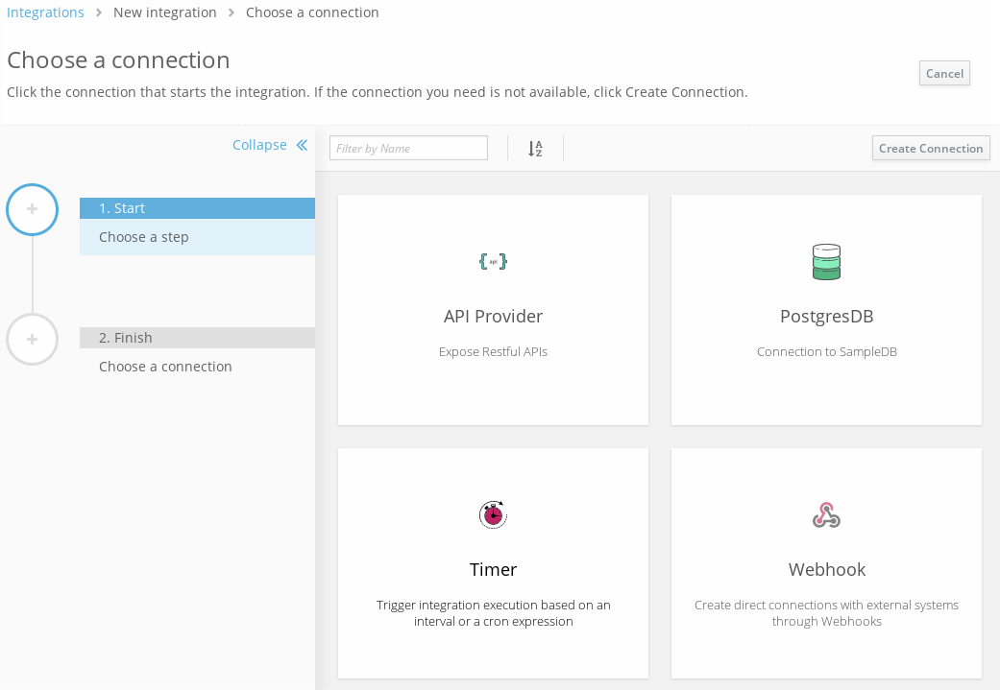

For our quickstart, we will use the simple timer operation.

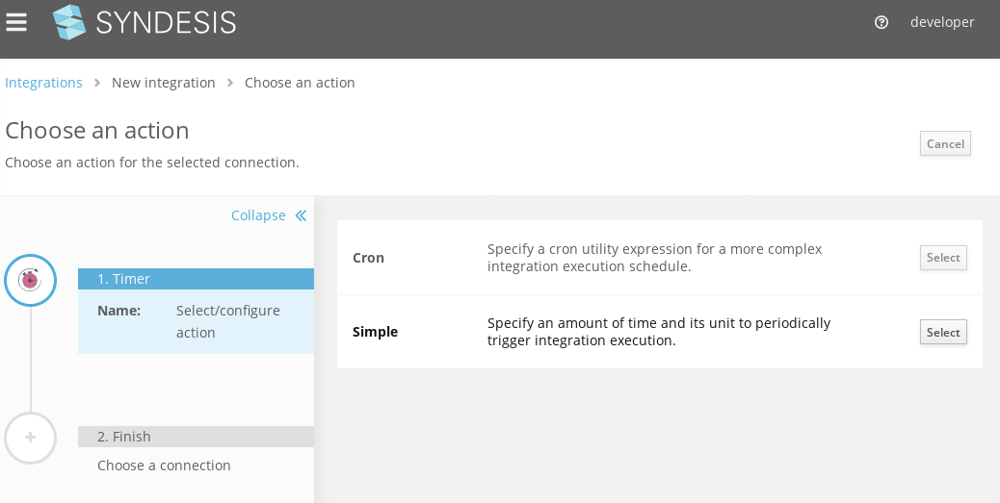

And we can configure the frequency with which our integration will run.

Our last step will be a simple log to output the contents of our DDB operations.

To achieve this, we select the "Message Body" from the output list of possible messages.

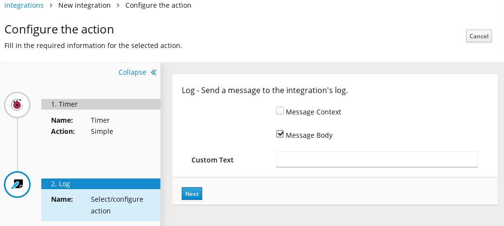

Now we are ready to add more steps using the "+" button between steps.

We are ready to add our first DDB interaction.

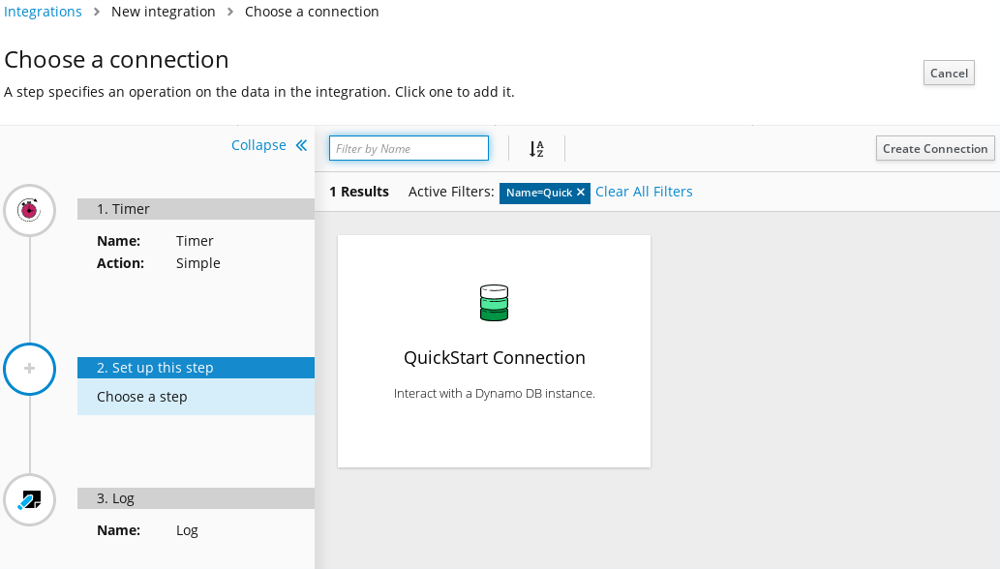

First we want to "Put Item" into the table to insert a new element.

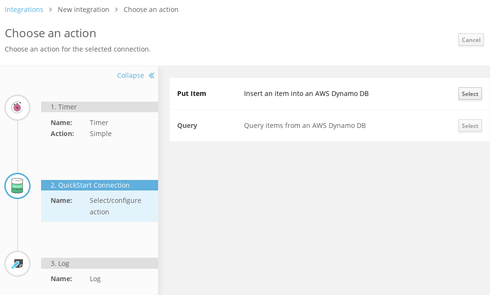

We define the element in JSON. Note that here is where we define the columns our row will have, as it is noSQL. 

If we had output variables from a previous step, we can use them here to map some of the elements and assign variable values to the columns.

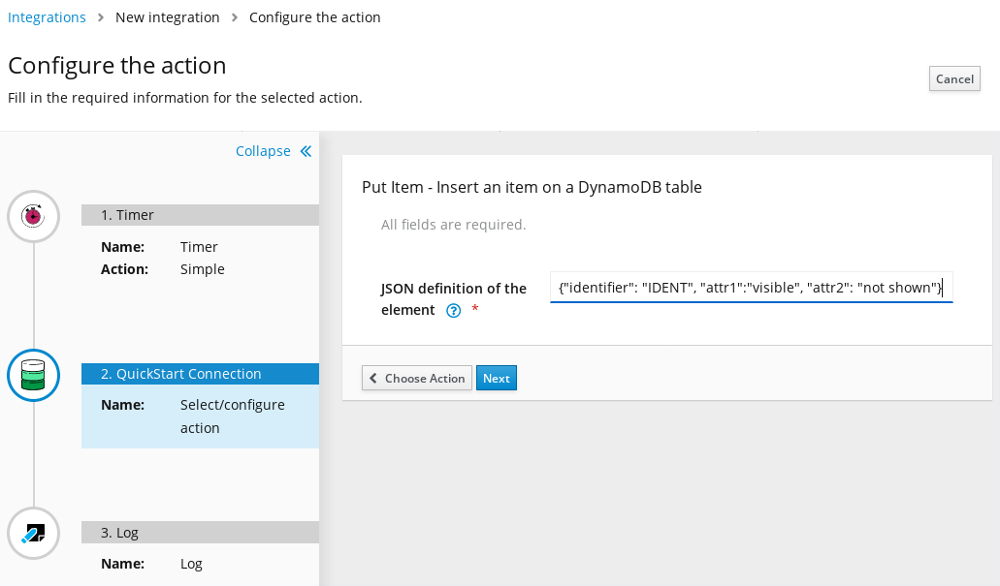

After our "Put Item" step, we add another log to monitor that the element was correctly inserted. This log output should be the element we just inserted.

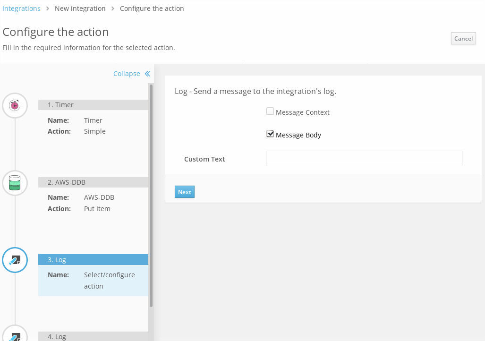

We are ready now to add a query step to extract the previously inserted element.

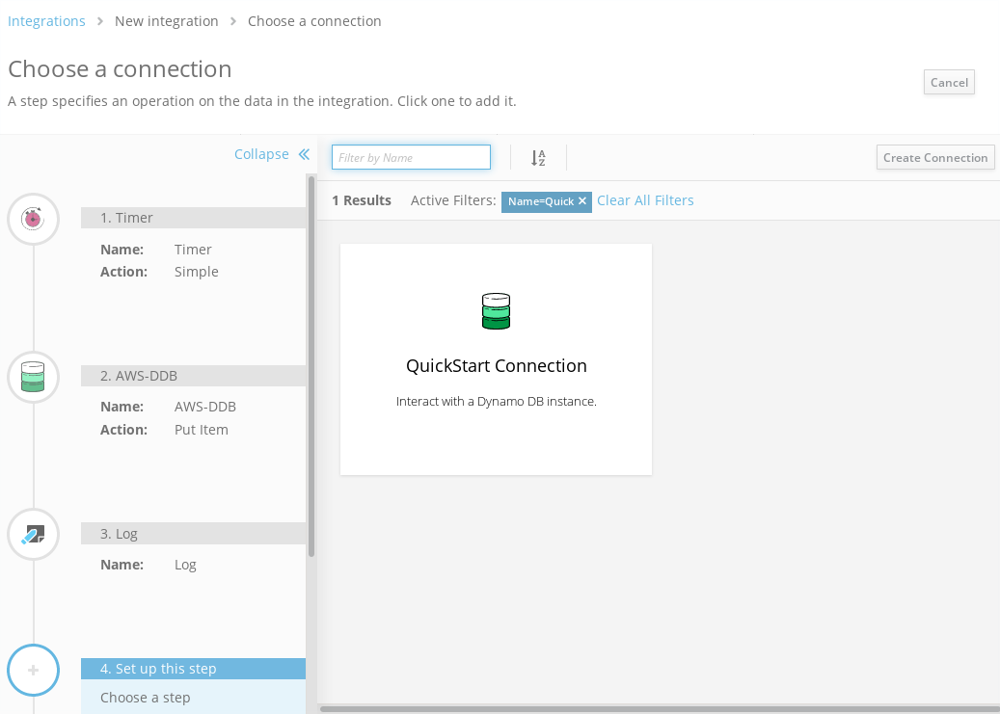

We can use variables like ":#KEY" to link to the previous steps to generate the query that will filter what element to extract.

Note that we filled the optional field "Attributes to query". This will define which columns we want to query.

If we used variables, like on our example, a warning sign will help us "Add a data mapping step" in between to link variables with values.

Syndesis provides a graphic helper to map the output of the previous step with the input of our current step.

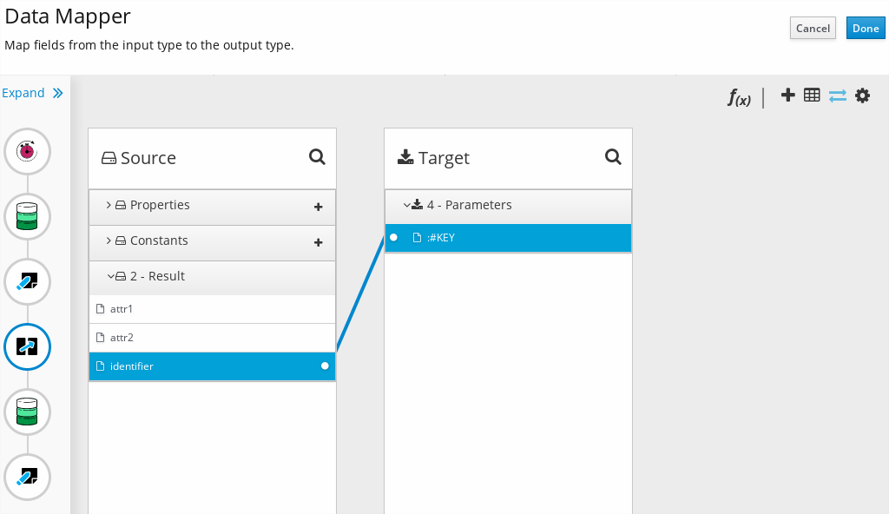

Once we finish the mapping, we can "Save and Publish" our integration.

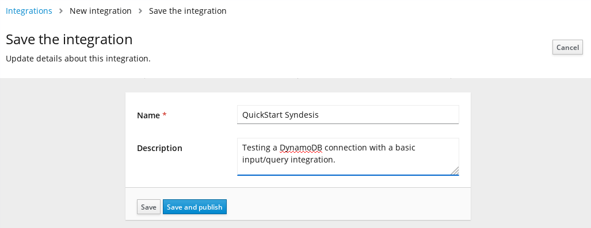

We have to wait for the integration to deploy.

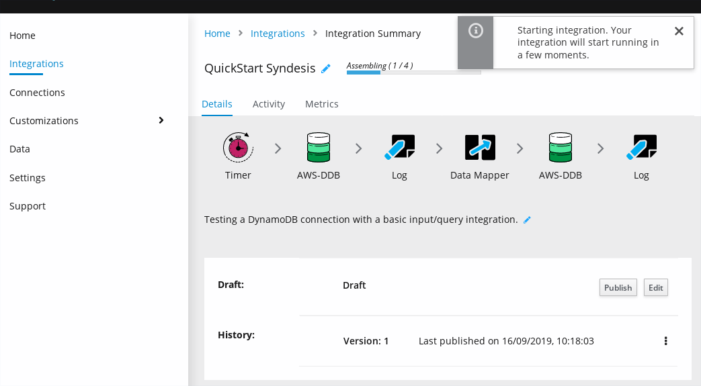

### See Activity

Once the integration is deployed, we can check on the DDB table that the element was properly inserted on the database.

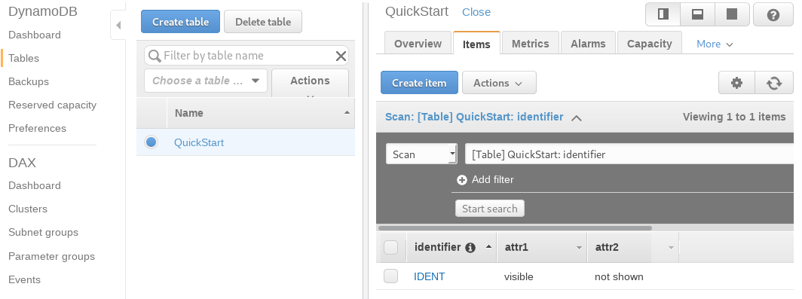

And we can monitor on the "Activity" tag on Syndesis all the logs that are being generated on every run of the integration.

Note that the last log is only showing the atributes we selected on the "Attributes to query" field of the Query step.

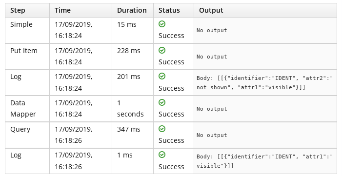

## What did we learn?
* We learned how to connect a DynamoDB table to Syndesis
* We learned how to insert elements on a DynamoDB table already connected to Syndesis
* We learned how to query elements on a DynamoDB table already connected to Syndesis
* We learned how to map output parameters into input parameters of later steps
