# Jira to Twitter

In this quickstart we will demonstrate how to retrieve comments from issues on Jira and send each comment as a twitter direct message. There are two prerequisites:
  * you need a `Twitter App` already registered with Twitter. If you have not done this, then please follow the [Twitter App Registration](../twitter-2-db/TwitterCredentials.md) instructions. Note that you will have to wait till your Developer account is approved by Twitter so in that case it's not really *quick* start.
  * you need a `Jira account` setup with an [Application Link](https://developer.atlassian.com/cloud/jira/platform/jira-rest-api-oauth-authentication/#overview). You can use an existing Jira server or the free [Jira Software in the cloud](https://www.atlassian.com/try).

## Screencast of this Quickstart

Link to a screencast of this quickstart on our youtube channel:

## Getting Started

### Twitter Connection

First we need to set up a `Connection` using the Twitter `Connector`. For that you need to go to connections and click the `Create Connection` button. 

*Figure 1. Create Connection*

*Figure 2. Configure Connection*

*Figure 3. Twitter OAuth Authorization*

*Figure 4. Name the Connection*

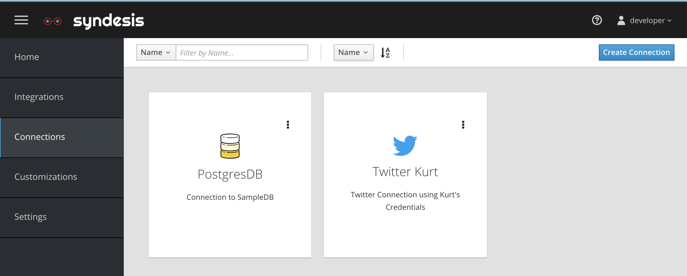
*Figure 5. Notice the new Shiny Twitter Connection*

### Jira Connection

[How to add the Jira connection](JiraConnection.md).

By now you should have a Twitter and Jira connection.

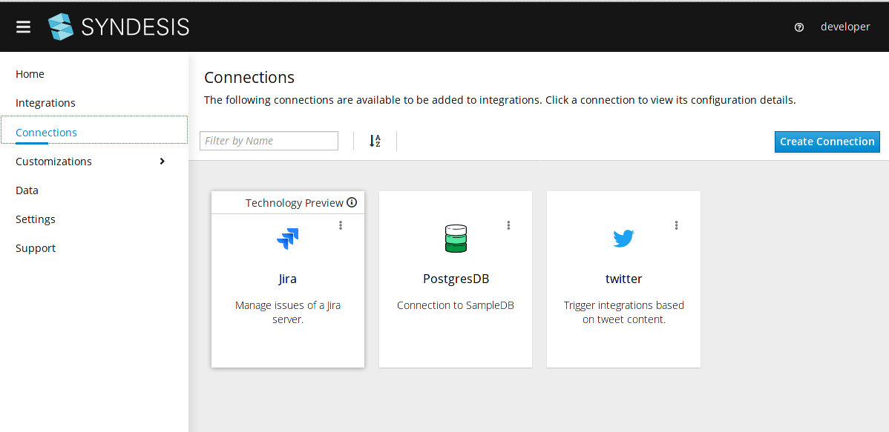
*Figure 4. Connections*

## Setting up the Integration

You can follow this instruction to build the integration or you can import the [jira2twitter-export.zip](jira2twitter-export.zip?raw=true).

Go to the `Integrations` menu on the left and click on `Create Integration`.

The Start Action should be a Jira connection that retrieves comments from issues every 5 seconds.

Click on `Retrieve New Comments` select button.

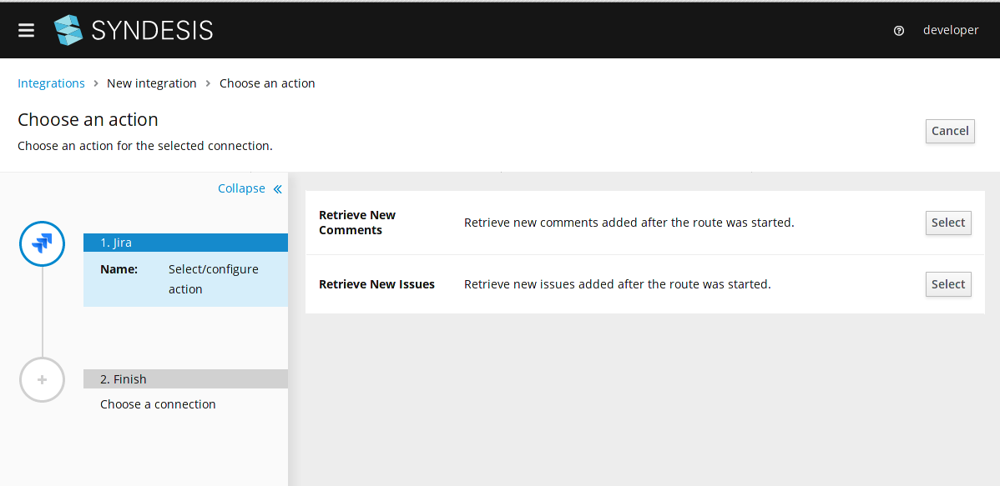
*Figure 5. Jira Start Connection*

Configure the parameters to retrieve the comments. It is important to set an optimized JQL (Jira Query Language) to search for a small set of issues, as the integration searches for all issues related to the JQL, then for each issue, then load all comments.

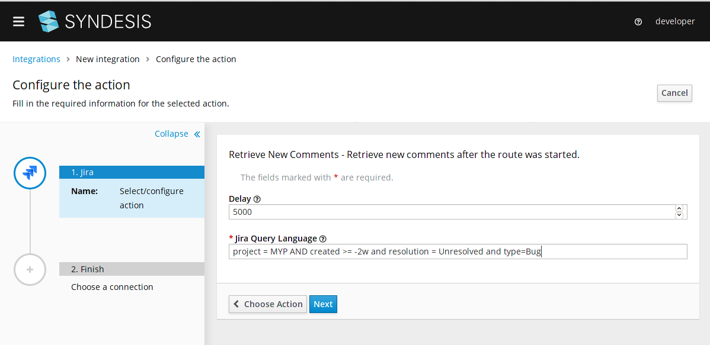
*Figure 6. Configure Jira to retrieve comments*

Choose Twitter as the final step.

*Figure 7. Finish Step*

Choose the `Send` action.

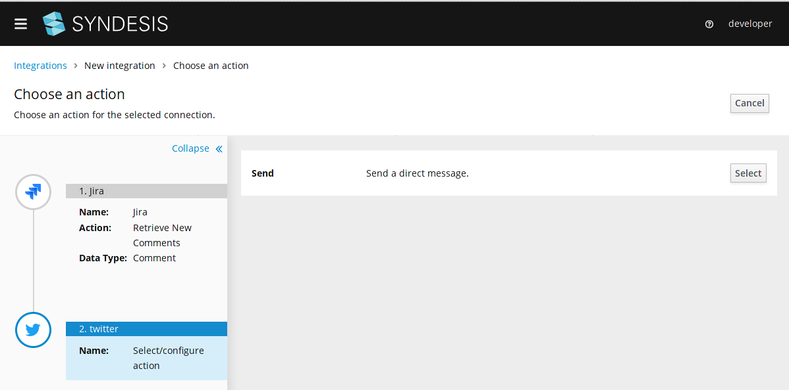
*Figure 8. Twitter Send Action*

Type in the twitter username to send the direct message to.

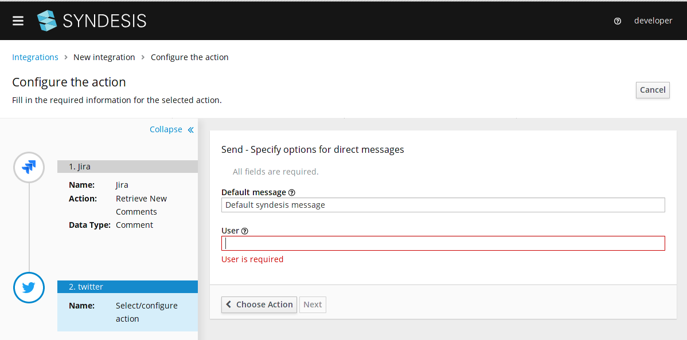
*Figure 9. Configure Send Action*

Now there is a data mismatch warn icon, this happens because the output of the Jira `Retrieve New Comments` is a `Comment` object and the `Twitter` action requires a `Message` object type, then we need to add a `Data  Mapping Step` to convert between those types.
Click on the `Add a data mapping step` link.

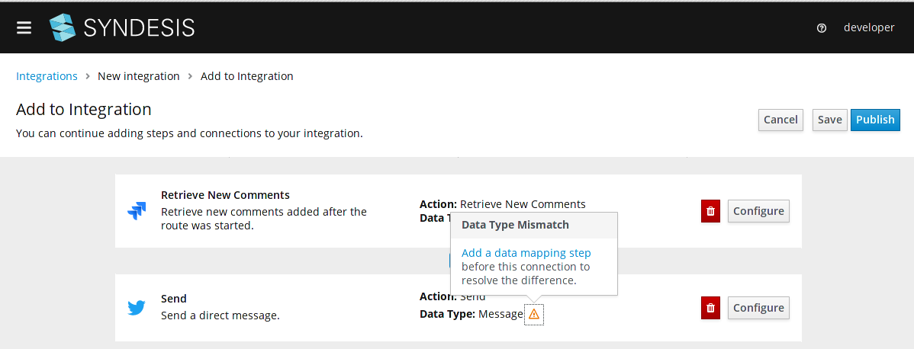
*Figure 10. Add Data mapping step*

On the left pane is the incoming input type `Comment`, you should click on the `body` attribute, then click on the `message` attribute on the right pane. 
Click on `Done` button on top when ready.

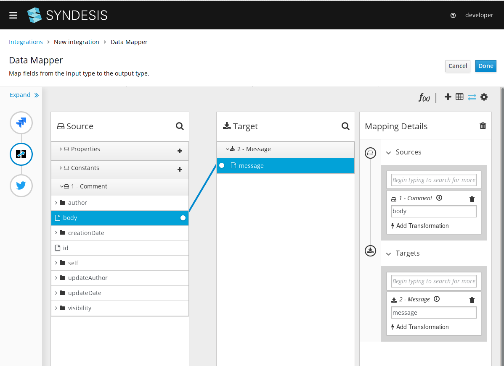
*Figure 11. Configure data mapping*

Click on `Save` button.

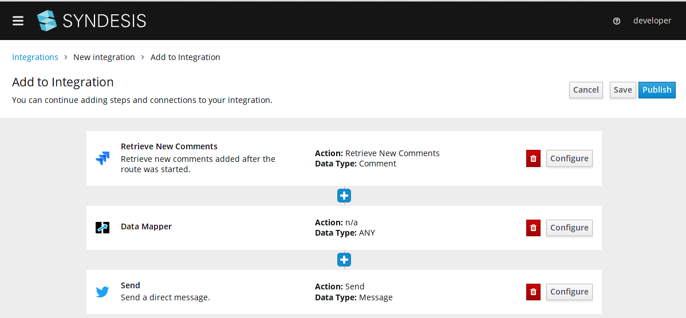
*Figure 12. Steps*

Write the integration name and click on `Save and publish` button.

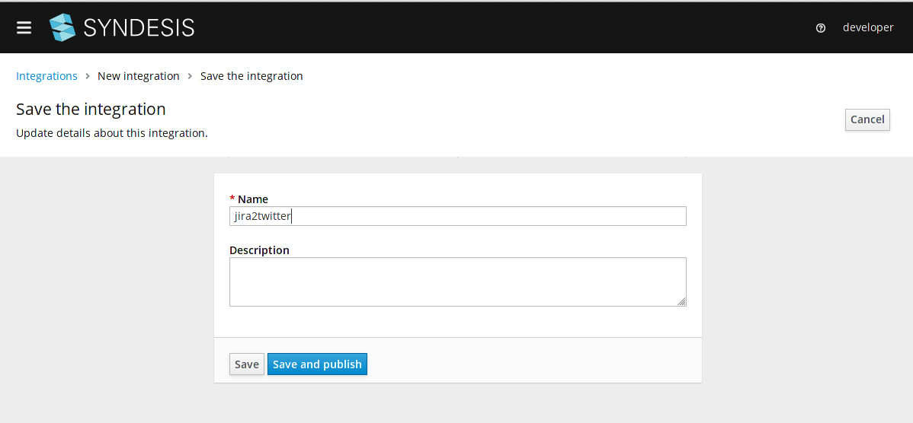
*Figure 13. Save integration*

Now wait for the integration to finish publication.

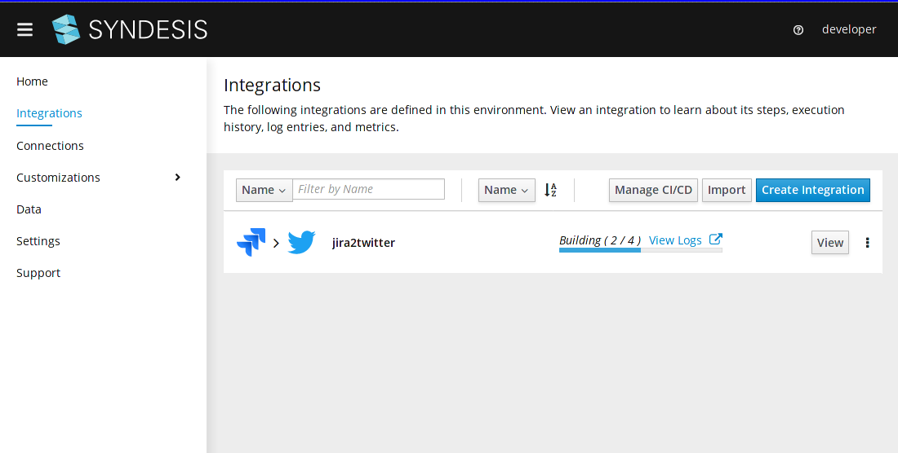
*Figure 14. Publish Integration*

After publication is complete and running, add comments to the jira issues related to the JQL previously set, then monitor the Twitter direct message inbox to see which messages were sent.

## What did we learn?

* We learned how to use OAuth Credentials to create a Twitter and Jira Connection.
* We learned how to use Jira to retrieve comments.
* We learned how to use Twitter to send direct messages.
* We learned to use the datamapper to map data from the Jira Comment object into a Twitter Message.
