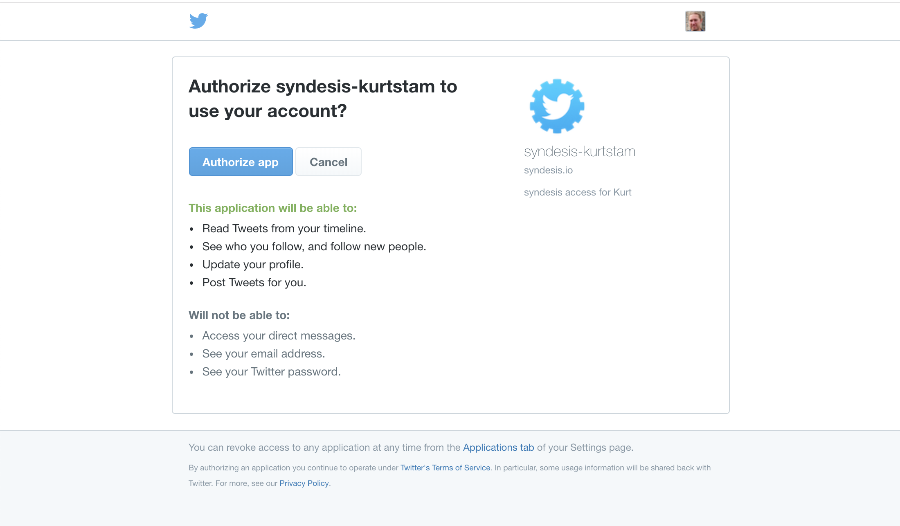

# Twitter to Database

In this quickstart we will demonstrate setting up a Twitter search that runs periodically and adds records into the database. A prerequisite to this QuickStart is that you have a `Twitter App` already registered with Twitter. If you have not done this, then please follow the [Twitter App Registration](TwitterCredentials.md) instructions. Note that you will have to wait till your Developer account is approved by Twitter so in that case it's not really *quick* start. 

## Screencast of this Quickstart

Link to a screencast of this quickstart on our youtube channel:

[](https://youtu.be/og7aMWJByNs)


## Getting Started

First we need to set up a `Connection` using the Twitter `Connector`. For that you need to go to connections and click the `Create Connection` button. 


*Figure 1. Create Connection*


*Figure 2. Configure Connection*


*Figure 3. Twitter OAuth Authorization*


*Figure 4. Name the Connection*


*Figure 5. Notice the new Shiny Twitter Connection*


You can follow with the video above to build the integration or you can import the Twitter2Db-export.zip.

The Start is a Twitter connecton that executes a search every 5 seconds for 

```
@syndesisio
```

As Finish connection we will map some fields into the `contact` table of our Postgres sampledb using an insert statement

```
INSERT INTO CONTACT  VALUES (:#first_name, :#last_name, :#company, 'twitter', current_timestamp)
```

Finally we add a datamapper step in between to map some data from the twitter search results into the insert statement.

Once the integration is published, you can check records going into the database by loghing into to the DB pod using

```
oc get pods
oc rsh syndesis-db-1-c84cz
sh-4.2$ psql -Usampledb
sampledb=> select * from contact;
  first_name   |      last_name      |        company        | lead_source | create_date 
---------------+---------------------+-----------------------+-------------+-------------
 KurtStam      | Kurt T Stam, PhD    | Ipswich, MA           | twitter     | 2018-10-25
 zregvart      | Zoran Regvart       | Berlin                | twitter     | 2018-10-25
 ppalaga       | Peter Palaga        |                       | twitter     | 2018-10-25
 PothJohn      | John Poth           |                       | twitter     | 2018-10-25
 oscerd2       | Andrea Cosentino    |                       | twitter     | 2018-10-25
 shoaibjdev    | Shoaib Khan         | India                 | twitter     | 2018-10-25
 freaky_styley | Christoph Deppisch  | Sommerhausen, Germany | twitter     | 2018-10-25
 KurtStam      | Kurt T Stam, PhD    | Ipswich, MA           | twitter     | 2018-10-25
 a_bouchama    | Abdellatif BOUCHAMA | France                | twitter     | 2018-10-25
 igarashitm    | igarashitm          | Westford, MA          | twitter     | 2018-10-25
 KurtStam      | Kurt T Stam, PhD    | Ipswich, MA           | twitter     | 2018-10-25
 zregvart      | Zoran Regvart       | Berlin                | twitter     | 2018-10-25
(12 rows)

```

The actual db podname will be different for you.

## What did we learn?

* We learned how to use OAuth Credentials to create a Twitter Connection.
* We learned how to use a Twitter Search.
* We learned to use the datamapper to map data from the Twitter search response into the a database table.


