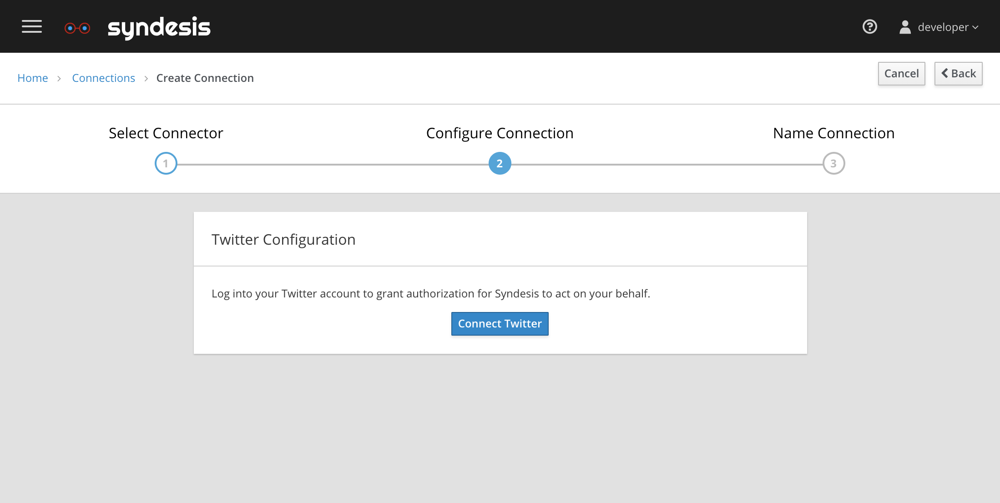
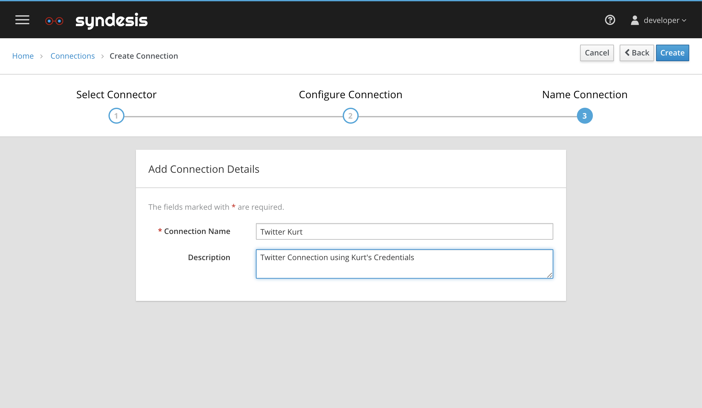
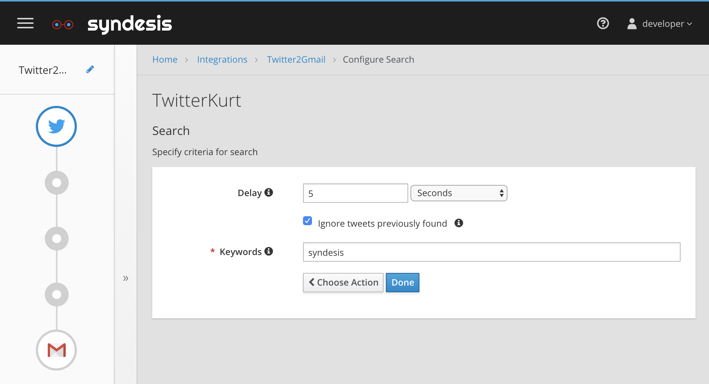
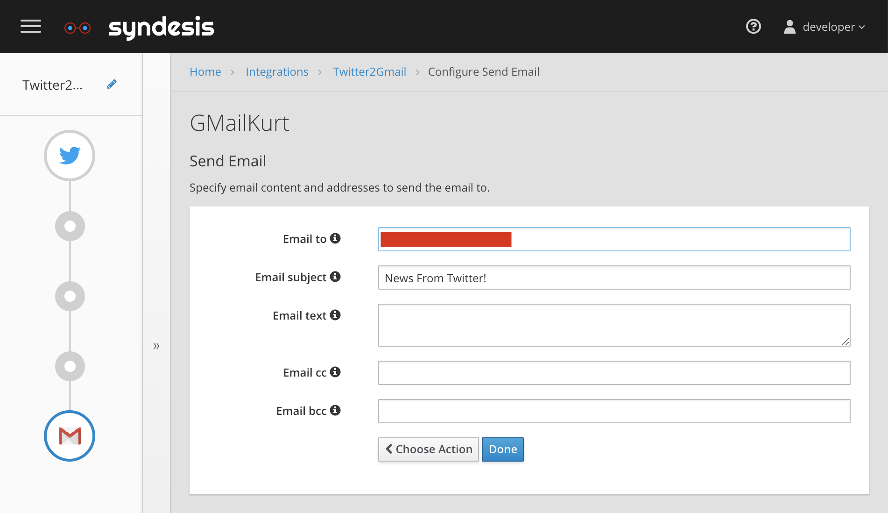
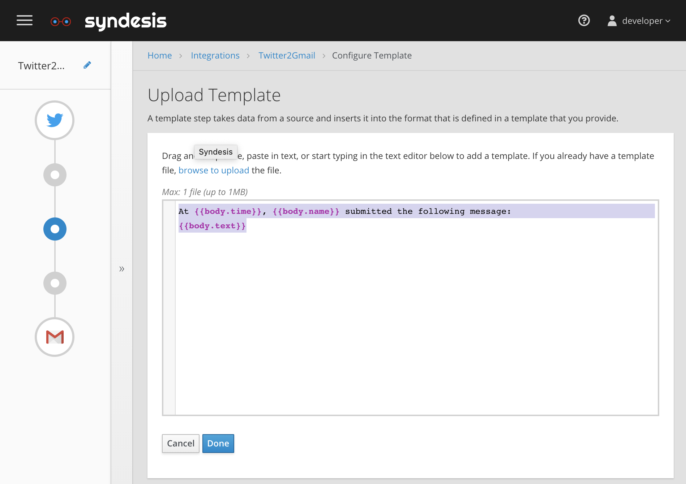
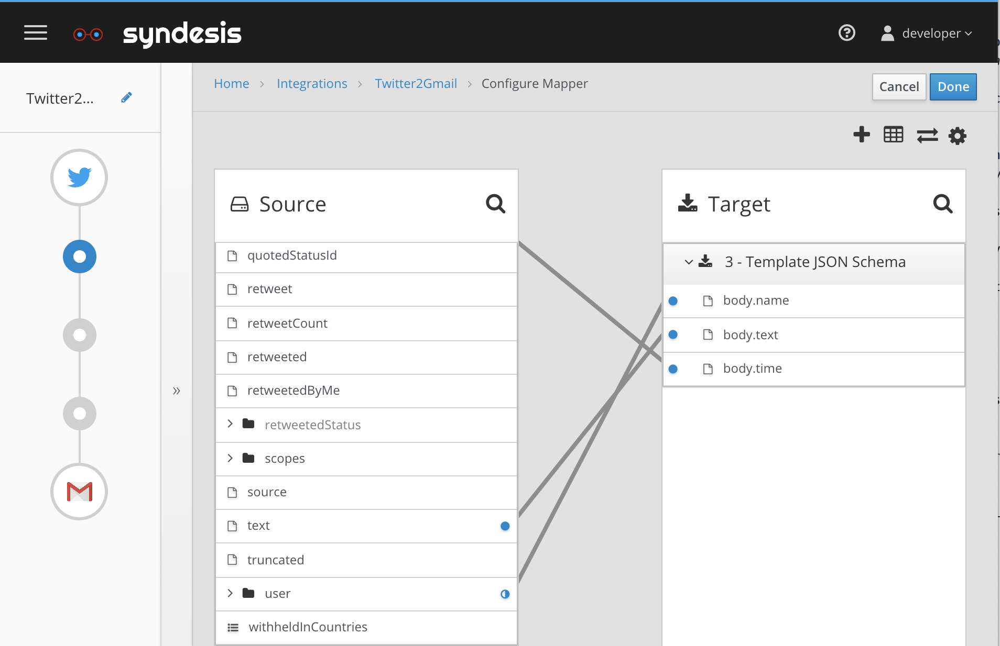
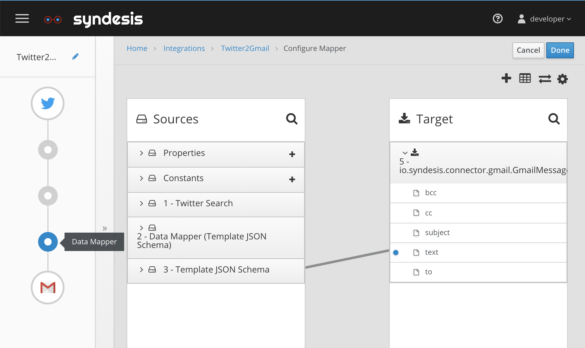

# Twitter to GMail using a template

In this quickstart we will demonstrate setting up a Twitter search that runs periodically and send matches out as email using the GMail API. There are two prerequisites:
  * you need a `Twitter App` already registered with Twitter. If you have not done this, then please follow the [Twitter App Registration](../twitter-2-db/TwitterCredentials.md) instructions. Note that you will have to wait till your Developer account is approved by Twitter so in that case it's not really *quick* start.
  * you need a Google Project with access to the GMail API. Please follow [Google API Creds](GmailCredentials.md)

## Screencast of this Quickstart

Link to a screencast of this quickstart on our youtube channel:

[](https://youtu.be/Pfysm8W8sco)

*`<<Click to Play>>`*


## Getting Started

First we need to set up a `Connection` using the Twitter `Connector`. For that you need to go to connections and click the `Create Connection` button. 


*Figure 1. Create Connection*


*Figure 2. Configure Connection*


*Figure 3. Twitter OAuth Authorization*


*Figure 4. Name the Connection*


*Figure 5. Notice the new Shiny Twitter Connection*

Secondly you will need to do the same exact thing for the GMail Connector to create a GMail Connection.

## Setting up the Integration

You can follow with the video above to build the integration or you can import the [Twitter2Gmail-export.zip](Twitter2Gmail-export.zip?raw=true), or you can create the a brand new integration.

The Start is a Twitter connecton that executes a search every 5 seconds for 

```
syndesis
```
also set a checkmark at `Ignore tweets previously found`.


*Figure 6. Twitter Start Connection*


*Figure 7. Gmail Finish Connection*

add a Template Step between Start and Finish and import the `gmail.tmpl` template file.


*Figure 8. Add Template Step*

then insert two datamapper steps


*Figure 9. Add Twitter to Template Datamapper Step*

```
CreatedAt -> body.time
text -> body.text
user/screenname -> body.name
```


*Figure 10. Add Template to GMail Datamapper Step*

```
message -> text
```

You are now ready to deploy the integration, and you should start receiving emails at the address you configured in the Finish Connection.

## What did we learn?

* We learned how to use OAuth Credentials to create a Twitter Connection.
* We learned how to use OAuth Credentials to create a GMail Connection.
* We learned how to use a Twitter Search.
* We learned how to use a Template Step.
* We learned how to use a GMail Connection to send out emails.
* We learned to use the datamapper to map data from the Twitter search response into the Template Step.
* We learned to use the datamapper to map data from the Template Step to an email body.


