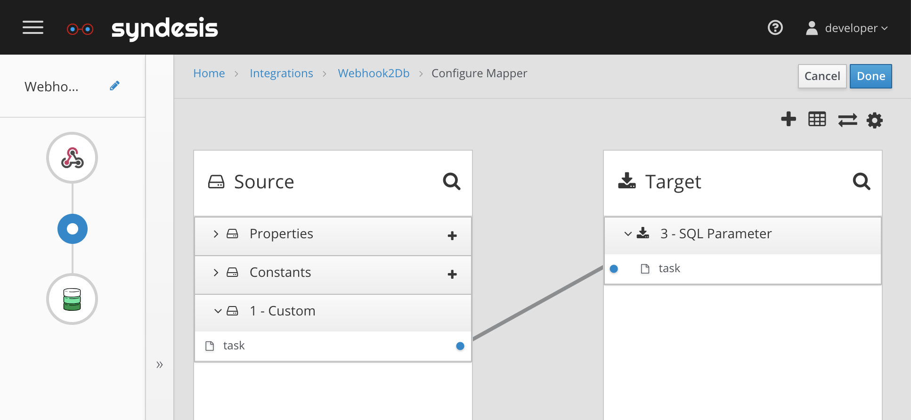
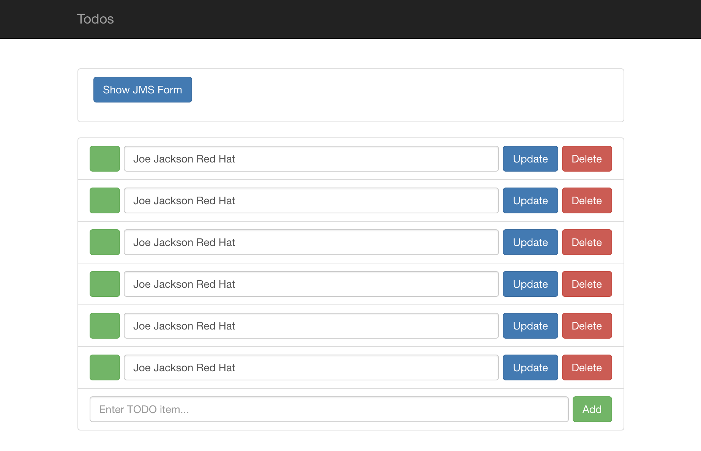

# Webhook

## Introduction
This shows how to setup a webhook, so that your integration can be invoked externally.

## Screencast of this Quickstart

Link to a screencast of this quickstart on our youtube channel:

[](https://youtu.be/mx6x_8QhF0Y)


## Getting Started

In the Syndesis UI navigate to `Integrations` and click on the `Import` button in the right top corner. Now you can select the [Webhook2Db-export.zip](Webhook2Db-export.zip?raw=true) file and start the import. Alternatively you can start with a create a new integration, and select the webhook as it's start connection.

Select JSON Instance and add an example JSON message such as:

```
{ "task":"some value"}
```

Click Done, and now add the Postgres SampleDB connection and use 

 ```
 INSERT INTO TODO ( task ) VALUES ( :#task )
 ```
 
 Finally add a Datamapper in between and connect
 
 ```
 task -> task
 ```
 

* Figure 1. Mapping task to task.

Now publish the integration calling it Webhook2Db.

On a succesful deployment it will show an externalURL. 


* Figure 2. ExternalURL of the webhook.

Put this into your buffer and create a env param like

```
externalURL=https://i-webhook2db-syndesis.192.168.42.101.nip.io/webhook/knmJINAonaMxWCtMEaR78QIAZbL8RgdVUDVsTDoUaig1IPHvCe
```

## Invoke Webhook

Now invoke the webhook with an HTTP POST using the cmdline utility called `curl` setting the `task` to "my new task!"
```
curl -k --header "Content-Type: application/json" --request POST --data '{ "task":"my new task!"}' $externalURL

```

You should see the new task in the todo app. You can obtain the URL to this app using

```
echo https://todo-syndesis.`minishift ip`.nip.io/
```


*Figure 3. Todo App with new Tasks appearing*

## Extra Credit

Add a Task in the Todo app by using Google assistant and nothing but your voice.

[@ni_ferraro](https://twitter.com/@ni_ferraro) created a nice demo using https://ifttt.com to inspire you

[](https://youtu.be/SfPaER5AYhQ)
